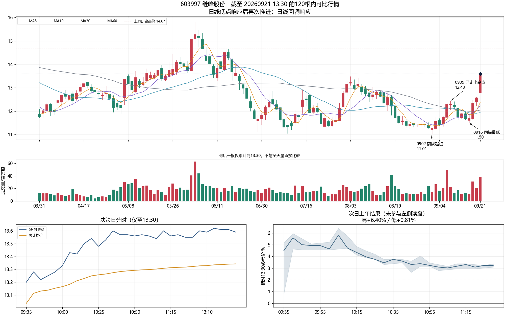
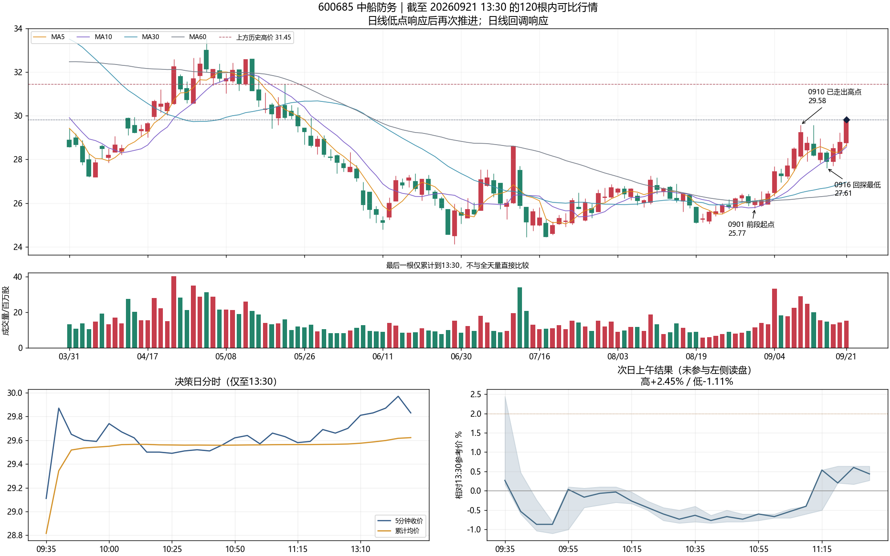
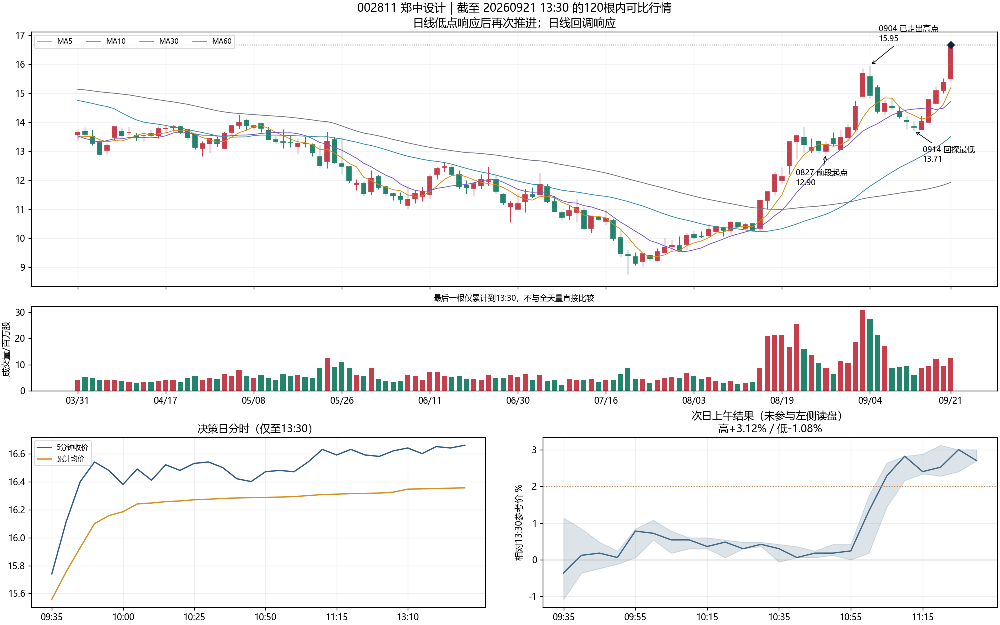
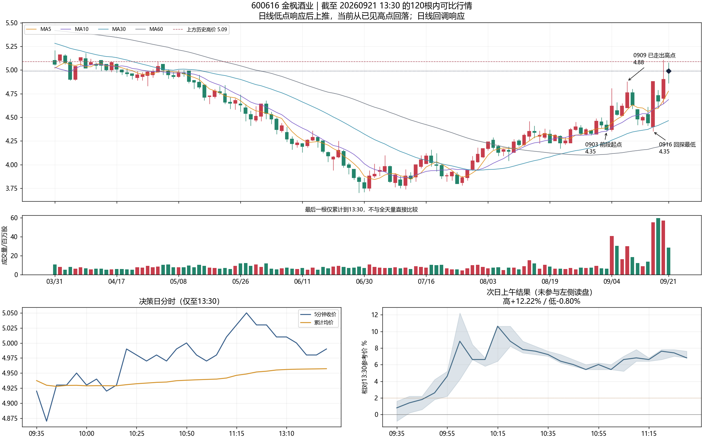
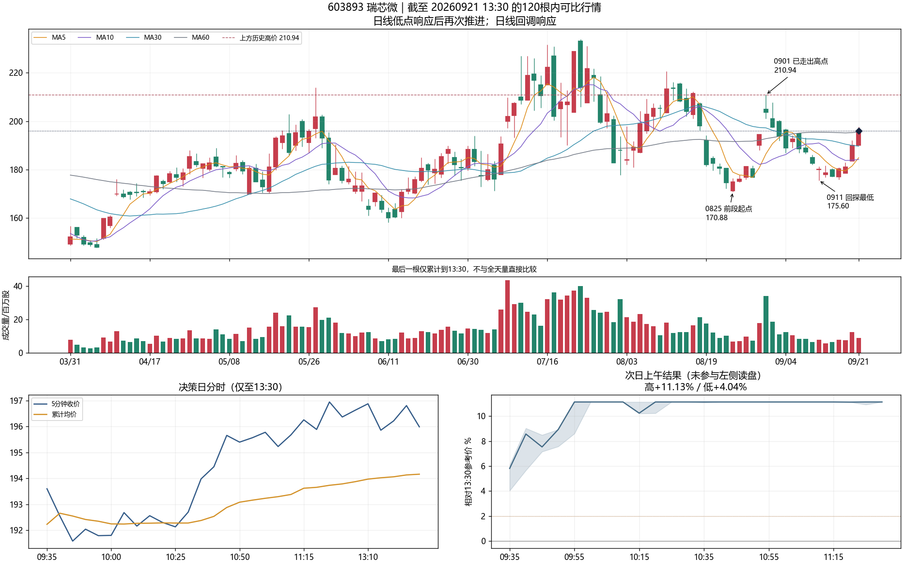
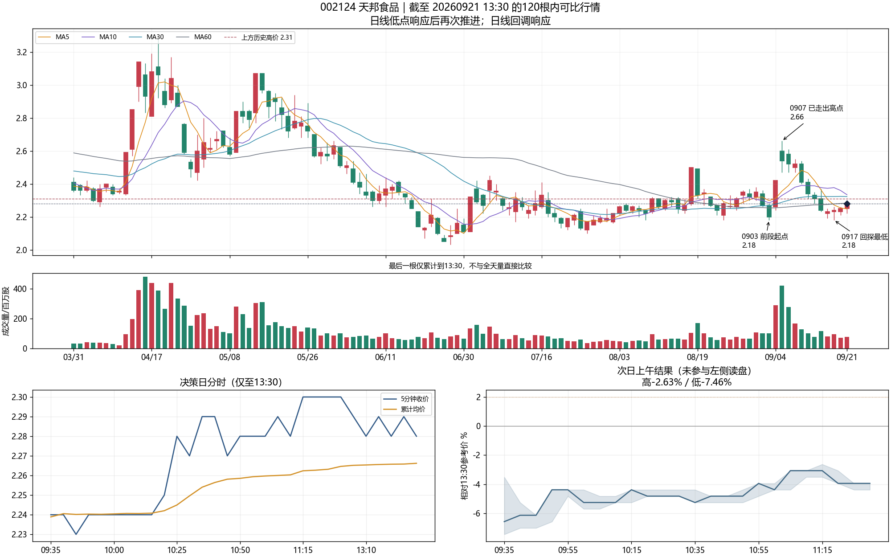
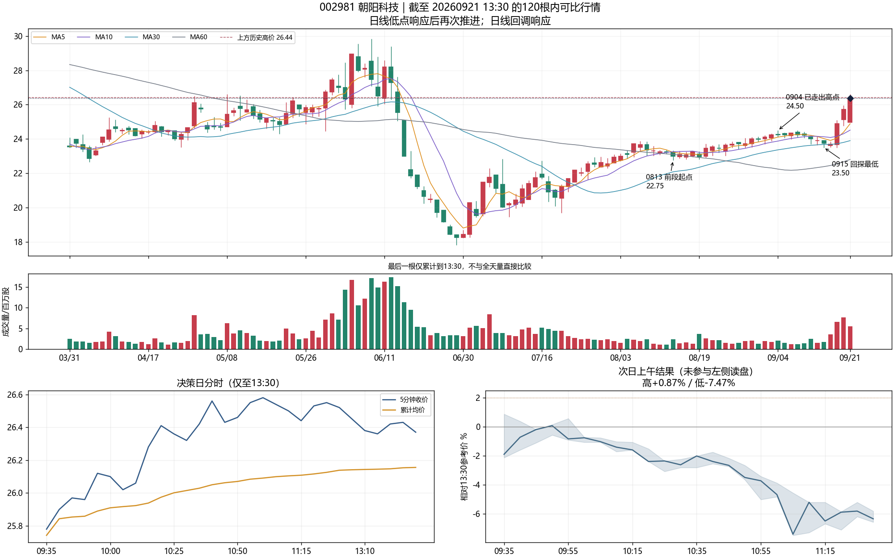
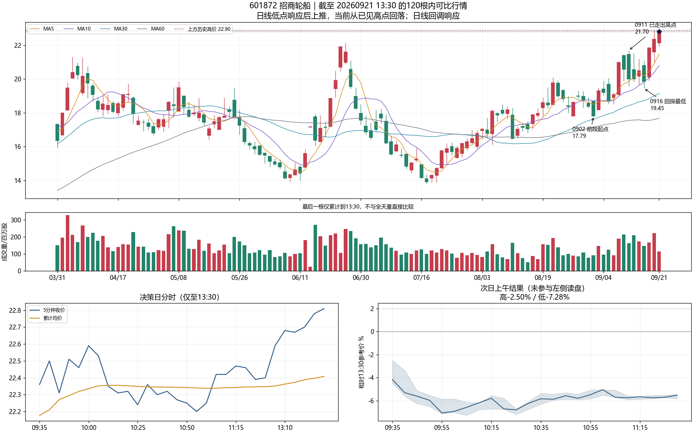
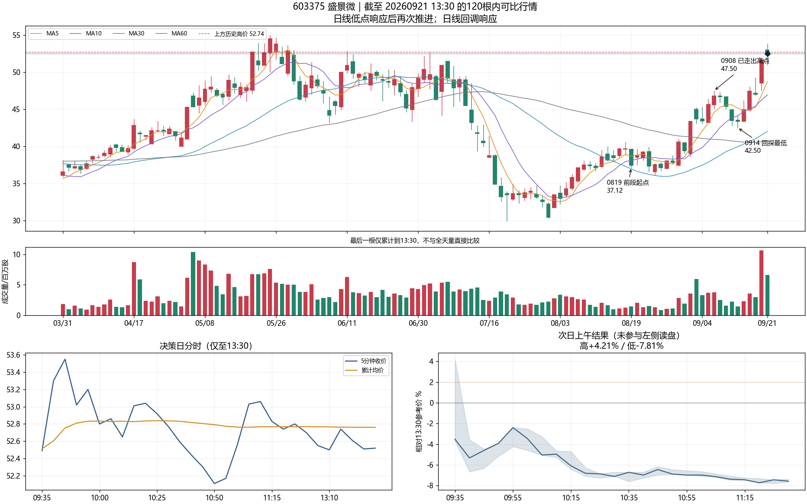

# 9月21日：保留的九个观察案例

> 文档集版本：V3.2-D004｜策略版本：V3.2｜文档修订：D004｜修订日期：2026-09-28
> 文档角色：历史案例解释；行情与结果时点仍为2026-09-21/22。版本规则与差异见[版本说明与变更记录](../../04_版本管理/版本说明与变更记录.md)。

观察时点：2026-09-21 13:30；独立结果窗口：2026-09-22 09:30—11:30。整理于9月28日，没有重新选股或回测。前三个来自原人工重点复核，其余为事后对照，不能冒充当时全部选中。本页用于读盘对照，不估计长期胜率。

## 可核对的结果

|股票|13:30参考价|次晨最高空间|次晨最低空间|11:30变化|
|---|---:|---:|---:|---:|
|603997 继峰股份|13.59|+6.40%|+0.81%|+3.24%|
|600685 中船防务|29.83|+2.45%|−1.11%|+0.44%|
|002811 郑中设计|16.66|+3.12%|−1.08%|+2.70%|
|600616 金枫酒业|4.99|+12.22%|−0.80%|+6.81%|
|603893 瑞芯微|195.99|+11.13%|+4.04%|+11.13%|
|002124 天邦食品|2.28|−2.63%|−7.46%|−3.95%|
|002981 朝阳科技|26.37|+0.87%|−7.47%|−6.33%|
|601872 招商轮船|22.81|−2.50%|−7.28%|−5.52%|
|603375 盛景微|52.52|+4.21%|−7.81%|−7.58%|

收益均相对前日13:30参考价，不是次日相对前收盘的涨幅；大于10%不直接表示价格超过涨停限制。最高空间不是实际可成交利润，最低也不等于实际亏损。此次逐条核对了保存结果的算术、日期、时点及与读盘参考价的一致性，没有重新下载独立行情证明源数据绝对正确。

## 当时发生了什么

### 继峰股份：已有回调后的再次推进

9/2低11.01 → 9/9高12.43 → 9/16低11.50，随后再推进。回落/推进均量0.48倍；9/21同刻成交额3.62倍，均价上方抬升后横住。属于第一波后承接再上推，不是下跌中猜最低点。

冲突也保留：13:30已经离11.50较远，不能叫“刚企稳”；汽车配件同行119/161上涨，但只有39.13%站均价，三只历史成交额代表均在均价下方。个股独强仍给出机会，不能据此把同行偏弱统一设为否决条件。

### 中船防务：有逻辑但空间普通

9/1低25.77 → 9/10高29.58 → 9/16低27.61 → 再推进。回落/推进均量0.88倍；10:45收回均价，11:20回探29.53后有响应。其他5只船舶同行全上涨且站均价。

这是有承接和同行呼应、却只有普通机会的例子。旧29—30元区域仍需核对，当时距回落低点已约8%。次晨最高+2.45%，11:30仅+0.44%；不能假定拿到上午结束与冲高兑现一样。

### 郑中设计：趋势中的再推进

8/27低12.90 → 9/4高15.95 → 9/14低13.71 → 再上推。回落/推进均量0.69倍，9/21越过15.95且在均价上方。装修装饰同行14/17上涨，但只有9/17站均价。

13:30距13.71约21.5%，属于已经推进的趋势机会，不是底部伏龙。位置高不自动等于错误，仍要明示价格伸展与同行分化的冲突。

### 金枫酒业：回探同一低位后，已经再次拉升并整理

9/3低4.35 → 9/9高4.88 → 9/16再次4.35 → 9/18高5.11，9/21整理到13:30的4.99。当日同刻成交额0.83倍，其他5只红黄酒同行全上涨且站均价，会稽山涨停。

这是原人工前三之外的事后大机会。要观察的是低点之后已经重新推进，不能把所有“回到原低点”的股票看成同一状态，也不能要求买入日一定放量。

### 瑞芯微：较弱同行截面中的个股修复

8/25低170.88 → 9/1高210.94 → 9/11低175.60 → 修复。回落/推进均量0.69倍；13:30为195.99，高于均价0.94%，距所记录前高210.94约7.63%。

同行只有27.78%上涨、8.33%站均价，三只成交额代表均在均价下方。行业指数当时截面缺失，不能补用收盘值。此例给了大机会，只支持“弱板块不能完全替代个股判断”，不证明独立走强总更好。

### 天邦食品：缩量不等于回调健康

9/3的2.18 → 9/7的2.66 → 9/17又回到2.18；13:30仅修复至2.28。回落/推进均量0.37倍，但整段涨幅已基本退回。相比金枫酒业，差异是低点后尚未走出同样程度的再次推进。

农业综合同行88.89%上涨且站均价，有3只涨停，不能把次日失败解释成板块弱。观察到的是个股回撤与浅修复的冲突，不足以证明它是下跌唯一原因。

### 朝阳科技：本票分时强，前高与同行仍有冲突

8/13低22.75 → 9/4高24.50 → 9/15低23.50 → 再推进。13:30价26.37贴近历史26.44，回落/推进均量0.84倍，早盘五分钟收价在均价上方。

元器件同行仅16.67%站均价，三只成交额代表均在均价下。次晨只有开盘附近很小的正空间，随后明显下探。不能因为本票分时强就省去前高和行业内部核对。

### 招商轮船：表面共振仍会失败

9/2低17.79 → 9/11高21.70 → 9/16低19.45 → 9/18高22.90，13:30价22.81。分时收回链有记录，同行94.12%上涨且站均价，成交额代表也同向。

当时冲突是：贴近22.90旧高、离回落低点约17.28%，回落/推进均量1.21倍并未收缩，当日同刻成交额只有0.82倍。次晨没有正向机会。不能说每个失败都因板块弱，也不能把这些冲突事后写成“当时已经必跌”。

### 盛景微：先冲高、后急跌，不能只留一个结果标签

8/19低37.12 → 9/8高47.50 → 9/14低42.50 → 再上推。回落/推进均量0.79倍，但13:30的52.52靠近52.74旧高，已离回探低点约23.58%，且低于当日均价0.46%。同行站均价仅11.11%；行业指数当时截面缺失。

次晨09:30—09:35曾给+4.21%，随后09:35—09:40跌到−5%，全天上午最低−7.81%。这是机会短、风险大的案例，不是“完全没有冲高”，也不等于必能兑现最高价。

## 证据与边界

原[候选事实](证据/candidates.json)、[决策数据清单](证据/decision_manifest.json)、[独立结果](证据/outcomes.json)原样保留。九只股票的日线和分钟冻结输入在 `证据/sources`，读盘记录在 `证据/facts`；原图的自动转折标记仍是局部事件近似，不能当成所有大级别高低点已经判准。

原始路径写在旧清单里，文件搬迁映射保留在本机`6龙策略/99_历史归档/整理_20260928/`，不随本次上传。旧决策清单记载的全市场原路径并非仓库文件清单；仓库只附本页九个案例的冻结输入，不能按旧清单重跑完整回测。同行采用保存的行业映射与当时可用成员，不等同完整历史成分审计。这里只整理已有证据、纠正解释边界，不宣称完全解释了次日涨跌。
