# 六龙阶段图文指南：从完整路径读懂当前生命周期

> 文档集版本：V3.2-D009｜策略版本：V3.2｜文档修订：D009｜修订日期：2026-09-30
> 文档角色：阶段解释与图例附件。本文用于帮助人和接手 AI 读懂已有案例，不是新的回测成绩，也不是机械选股公式。

本指南有两类图片：`教学图/`的9张图全部由虚构数值绘制，只解释定义和判断顺序；`0921案例/`的9张图来自已有历史资料，用于核对实际差异。前者不能加入回测，后者也不是18个新增样本。真实案例没有核实某项阶段条件时，只作相邻过程参照，不强行贴阶段标签。策略规则以[主规范](../00_当前策略/六龙策略V3.2_生命周期优先规范.md)为准。

## 1. 先记住三件事

### 1.1 生命周期不是固定流程图

一只股票不一定按“潜龙→见龙→惕龙→或跃→飞龙→亢龙”完整走完。阶段可以跳过、重复、嵌套，也可以在失败后重新开始。六龙名称是对已经发生的价格状态的语言，不是预测未来的标签。

我们先写事实，再写阶段解释：

> 低点在哪里 → 是否出现价格响应 → 第一波怎样推进 → 回落是否破坏结构 → 当前是否重新推进 → 现在离前高和均线有多远。

如果事实不足，就写“下降后的修复”“平台内试探”“上推后的回落”等直白描述，不为图表凑出完整龙链。

### 1.2 阶段和买点不是一回事

当前规范中，生命周期描述“股票正在发生什么”；伏龙、或跃、涨停价回踩等是“可以研究的动作参照”。伏龙不是生命周期阶段，出现伏龙也不代表可以跳过前置路径、位置、量价、分时和行业核对。

### 1.3 结果不能反推当时的判断

本指南中的图表包含独立的次日结果面板。读图时先遮住或忽略结果，先判断观察日以前发生了什么，再单独记录次日冲高、下探和先后顺序。不能因为后来涨了，就把当时不确定的低点改写成“已确认底部”；也不能因为后来跌了，就说当时已经知道顶部。

## 2. 阶段总览

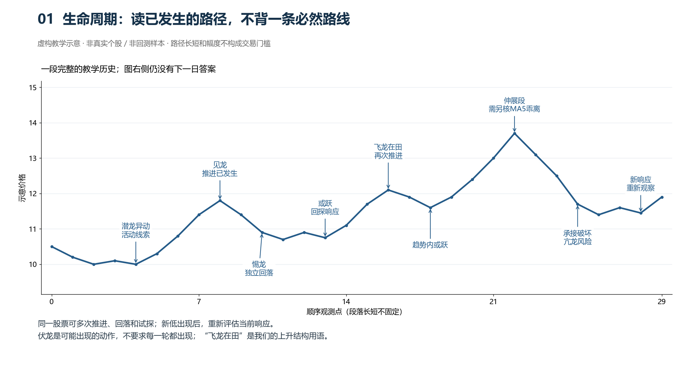

图1画的是一段已完成的虚构历史，不是从今天向右预测。每次实际观察只读截止时点左边的行情；图中的后续阶段不能提前用来确认前面的低点。

### 2.1 我们为什么从潜龙异动和涨停开始关注

目的首先是找出“交易状态发生了变化，而且留下可追踪路径”的股票。原来平淡的量额开始活跃、价格离开整理区、涨停推动到新的价格区间，都比只看某一天的涨幅多提供了一个观察起点。我们随后关心的是：这次推动留下的价格区间，后来有没有被市场继续接受；回落时卖出压力增加还是减少；再次推进时是否还有活动和同行呼应。

这里的“资金痕迹”指成交与价格行为。放量反映交易增加，涨停反映价格在当日规则下触及上限；二者都不能单独证明某一个主力建仓、锁仓或还没有出货。观察的价值在于形成能反复核对的问题，不在于给一根K线编造确定的资金意图。

|已看到的变化|为什么值得跟踪|下一步重点观察|不能直接推出|
|---|---|---|---|
|单日倍量|交易相对昨日突然活跃|量集中在上涨还是下跌，价格是否有效位移，随后是否保持|倍量日一定是底部或买点|
|逐步放量|活动持续偏离此前平淡状态，可能没有单日翻倍|实际比较基准、推进效率、回落量价与低点响应|没有倍量就没有资金活动|
|涨停或低量一字板|价格出现明显推动，并留下日高低价等参照|涨停区间之后是否承接、刺破后是否回收、当前是否有可买入价格|成交量小就没有推动，或涨停后必有第二波|
|已经出现第一波及其后承接|可以研究一段已有事实支持的延续或修复|最新回探是否破坏当前依据，前高、分时和同行是否相容|此前上涨过就能一直推荐|

先等第一波表现，是我们当前选择研究的范围。它减少了猜下降中突然见底的情形，也会放弃一些从最低点直接拉起的利润；是否换来了更好的隔日机会，需要同口径回测，不能仅凭逻辑宣称已经提高胜率。量能、涨停、均线和板块都是线索，最后仍要解释“这只股票走到这里，我们准备参与哪一段”。

### 2.2 怎样按图学习

先看图1理解可重复的路径，再看图2和图3理解观察起点；图4区分事件发生与当时可知；图5—8分别解释回落、试探、上升、伸展和失效；图9只解释伏龙动作。每张图都问：已发生什么、为什么值得观察、还缺什么、哪种事实会推翻当前解释。下面分节将这四个问题展开。

|名称|当前使用的直白含义|观察重点|常见误读|
|---|---|---|---|
|潜龙|低位或平台开始活跃，仍在等待方向确认|异常活跃、倍量、渐进放量、涨停推动之后是否有响应|把第一根放量直接当成底部确认|
|见龙在田|第一波推进已经显现，价格从低位/平台离开|低点响应、推进高点、是否突破或接近重要压力|把任何上涨都叫见龙|
|惕龙|已有推进后出现独立回落|回落是否仍创新低、量价是否健康、局部支撑是否失效|把回落和企稳合并成一个阶段|
|或跃在渊|回落后的试探、承接或趋势回踩|是否停止下移、是否收回、试探后能否再推进|只要没有破昨日低点就叫或跃|
|飞龙在田|高点和承接低点整体抬高的上升结构|多轮推进与回落是否保持抬高，当前是否仍有空间|只看最近两个小拐点抬高|
|飞龙在天|上升过程中明显远离 MA5，价格伸展较大|偏离均线、前高、分时冲高回落和兑现风险|把远离均线等同于一定还能涨|
|亢龙有悔|推进后失速、压力反复或承接破坏的风险状态|是否跌破最近有效承接、冲高回落、量价冲突|用次日下跌倒推观察日必然见顶|
|伏龙出渊|一个买点动作：开盘低于当时 MA5/10，随后重新收回|前置生命周期、回收是否有效、13:30位置、分时过程|把信号本身当成完整买入理由|

### 2.3 为什么还要看板块和同行

个股是主要对象，行业指数和同行不是替代品，而是互证信息。相同的个股路径，若同行正在同步收回、板块指数有修复，说明市场上存在更广的承接背景；若个股独自站上均价、同行普遍无响应，则仍可保留，但必须明确这是“个股独强”，不能把它写成板块共振。板块没有进入前十也不自动否决，进入前十也不自动推荐。

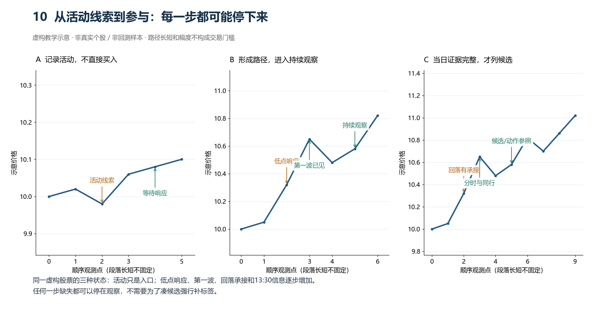

图10把过程拆成三道门：活动只产生观察线索；第一波、回落和承接形成持续观察；到当日13:30，生命周期、位置、量价、分时和同行能够互相解释，才列候选。它不是新的信号公式，也不要求每天凑满候选。

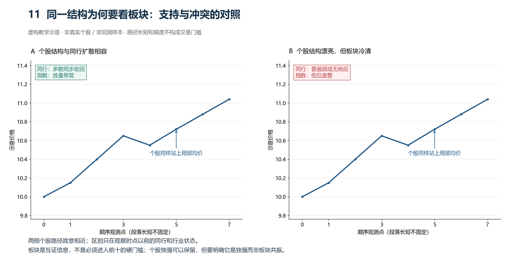

图11故意让两侧个股价格路径相近，只改变同行和行业背景。左侧可以写“结构与同行扩散相容”；右侧应写“个股独强、板块互证不足”，而不是因为板块冷清就强行判定必跌。真正的取舍仍要回到位置、前高、承接和可兑现空间。

## 3. 潜龙：低位开始活跃，但还没有确认方向

### 3.1 形成过程

潜龙不是“绝对最低点”。它表示股票在较长时间低迷、平台或缩量整理后，出现了值得继续观察的活跃迹象，例如：

- 相邻完整日成交量明显放大；
- 原本平淡的量能逐步活跃；
- 低位涨停、长阳或连续推动；
- 价格停止连续下移，并出现第一次可核对的响应。

倍量只能说明交易活跃，不自动说明资金一定建仓，也不自动说明下一波一定上涨。若放量日之后继续创新低，原先的“潜龙观察”要重新读，不能用旧放量替代当前企稳。

### 3.2 图例：潜龙背景与第一波推进

图中应先看 9/2 附近的低点和后续推进，再看 9/9 的高点。这里的重点不是把某根K线机械命名为潜龙，而是确认“低点之后已经有响应和推进”，股票从单纯下探进入可跟踪状态。

金枫酒业的 9/3 低点到 9/9 高点，展示了低位活动之后的第一段推进。它说明潜龙更像观察起点：要等后续价格路径走出来，才能判断这次活动是有效推进还是短暂反弹。

### 3.3 不能只凭活动就认定已形成有效推进

- 价格仍在连续刷新局部新低，只有孤立放量，没有响应；
- 只因为处于窗口低位，就推断已经安全；
- 只有一次异常成交，但没有可比较的前段量能；
- 观察时点已经离开原活动区很远，却仍拿旧放量解释当前状态。

### 3.4 失效和下一步

潜龙观察的下一步是等待第一波是否形成明确推进、再看回落和承接。若活动后重新破低，保留“当时确实出现过活动”的历史，更新为“当前仍下探／原企稳解释失效”，重新找新低后的响应。不能因后来失败就删掉倍量事件，也不能用保留了事件来证明现在可以买。

### 3.5 三种量价放在一起看

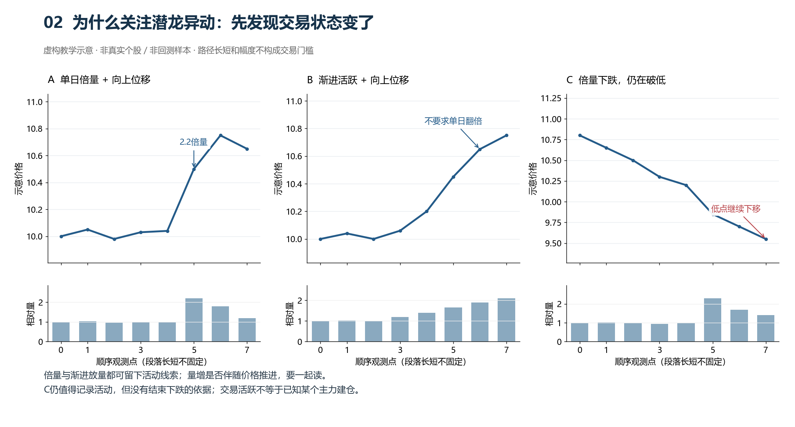

图2左侧按相邻完整日出现2.2倍成交量，价格也向上位移；中间没有任何一天必须翻倍，但活动逐步增强、价格向上离开原区域；右侧同样放量，却在打更低点。左中两例提供推进线索，右例提供下降中的活动线索，三者都还没有证明下一日会上涨。

**为什么关注。** 我们需要有活动背景、可以继续读盘的股票，而不是只从安静下跌中猜一个便宜价格。**等待什么。** 低点或平台后的响应、第一波实际推进、其后的回落和接受程度。**反证是什么。** 活动之后持续破低、推进很快全部退回、每次回收都失败。比较量能时用真实段落；13:30只能比较历史同刻数据，不能用半天量对全天量造出“缩量”。

## 4. 见龙在田：第一波推进已经被价格事实证明

### 4.1 形成过程

见龙在田是“第一波已经走出来”的描述，不是必须突破 MA60 的公式。至少要能指出：

1. 一个此前可追踪的低点或平台；
2. 低点之后出现价格响应；
3. 价格推进到一个可核对的高点或压力区；
4. 截至观察时点确有可核对的响应和位移，而非只凭一根阳线猜之后必有第一波；不增加“必须跨几个交易日”的要求。

突破 MA30/MA60 可以作为位置事实，但不是当前硬门槛。均线粘合、涨停推动或低位放量形成的第一波，也可以进入见龙观察，只要路径和位置说得清楚。

### 4.2 图例：第一波之后的位置

郑中设计从 8/27 低点到 9/4 高点，再到 9/14 回落低点，说明“第一波高点”必须依据已走出的路径确定，不能把观察日附近的小高点随意当成整段见龙高点。

中船防务的第一波高点、回落低点和 9/21 再推进较清楚。这个案例适合说明：见龙只表示第一波发生过，当前能否参与还要继续读惕龙、或跃和前高压力。

### 4.3 见龙不等于立即买入

见龙阶段通常是观察阶段。第一波已经发生时，追在推进末端可能离前高过近、离承接低点过远。我们的隔日研究更关心第一波之后是否出现可读的回落承接、趋势回踩或重新推进。

### 4.4 潜见合看，但活动日、低点、高点分开记录

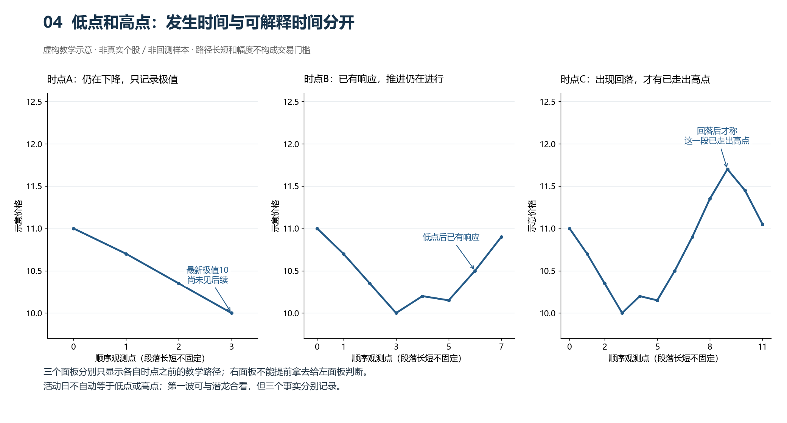

图4的A时点只能看到最新低价，B时点已经看到低点响应和上推，C时点才看到那次上推后的回落。活动可能发生在低点之前或之后；活动日不能直接当第一波高点。上推未停时记“截至当前已见最高价”，后来回落才更新为该段已走出高点。

**为什么关注。** 第一波给出了实际推进范围、活动起点和后续回撤的参照。**等待什么。** 回落是否被承接，或已有趋势是否在当前回踩后继续有效。**反证是什么。** 短暂上推后又恢复持续下移。潜龙和见龙可以合成“潜见”观察段；拆开讲是为了说明活动与价格响应，不要求每只股票走两套独立手续，也不要求见龙必须越过MA60。

## 5. 惕龙：推进后的独立回落

### 5.1 形成过程

惕龙必须和此前的推进分开看。它不是“价格跌了几天”的固定天数，也不是统一 3/5 回撤比例。需要回答：

- 前面哪一段上涨已经结束或暂时停顿；
- 回落是否形成了独立的价格段；
- 回落中有没有新的更低点；
- 回落量能相对推进是放大、收缩还是混杂；
- 当前回落是否已经停止，还是仍在下探。

### 5.2 图例：健康与不健康的回落要分开

继峰股份 9/9 高点到 9/16 低点是一个可单独观察的回落段，之后重新推进。读图时不能只写“缩量回调”，还要记录回落低点后来是否得到响应，以及当前价格已经离回探区多远。

天邦食品是重要反例。它的回落段量能偏低，但价格几乎回到前段起点，说明“缩量”不等于健康惕龙。回落深度、当前位置和后续响应必须一起看。

### 5.3 惕龙与企稳不能合并

回落发生时只叫惕龙观察；只有之后出现停止下移、收回、反复试探后不再破坏等事实，才进入或跃/承接观察。把两者合并会把正在下跌的票误认为已经企稳。

### 5.4 我们等待的是回落的响应，而不是等待够几天

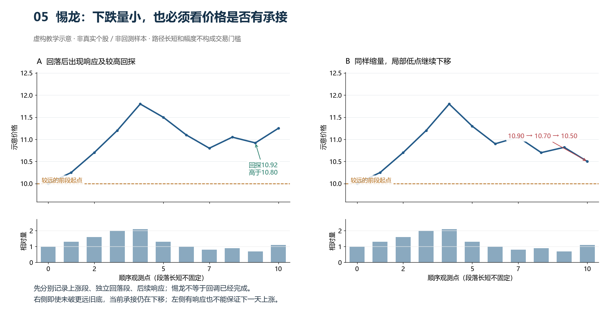

**为什么关注。** 第一波之后的回落让我们观察此前推进是否得到保留，以及下一次参与能依据哪个支撑区域。图5左侧回到10.80后有回收，再探10.92；右侧虽未破更远的10.00，但近期低点10.90→10.70→10.50仍在下降。两边都缩量，不能据此写出同一个“健康”结论。

**等待什么。** 停止持续下移之后的收回、试探、推进等真实响应；不是给未完成回落预设结束日。**反证是什么。** 当前相关低点持续被破坏、反弹又退回、更大级别压力没有被解释。回撤深不自动永久淘汰，浅回撤也不自动安全；新的响应要重新记录。

## 6. 或跃在渊：回落后的试探与承接

### 6.1 形成过程

或跃表示价格在回落后进行试探，可能成功向上，也可能继续下探。它可以出现在：

- 惕龙之后的底部试探；
- 上升趋势中的回踩 MA5/MA10；
- 涨停或放量后的回踩，只要价格没有破坏关键承接；
- 再次推进前的窄幅整理和承接。

或跃不是“没有创新低”这一条就够了。至少要写清是否有收回、是否重新破低、试探低点和前高在哪里、量能是否支持。

### 6.2 图例：回探后重新推进

金枫酒业 9/16 再次接近前段低位，随后到 9/18 重新推进。这个案例适合说明“回到旧低点”本身不是买入理由，关键是之后是否出现真实响应和再推进。

中船防务展示了回调承接、早盘收回均价和随后再推进的组合。它次日空间普通，说明结构逻辑成立不等于必然有大肉。

### 6.3 或跃失败

以下情况要记录为试探失败或重新观察：

- 试探后继续创新低；
- 只出现短暂刺破收回，但随后价格中心继续下移；
- 早盘站上均价后很快失守，且日线承接没有改善；
- 接近前高但量价尚不能解释推进，是额外冲突；不能仅凭“前高近”就宣布或跃失败。

### 6.4 底部试探与趋势回踩为什么都叫或跃

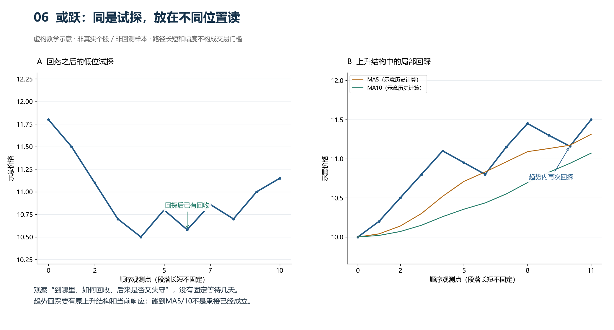

共同点是价格在测试一个区间能否继续被承接；不同点是底部试探正在争取恢复推进，趋势回踩是在检验已有上升是否还能延续。图6左侧的10.50后有更高的回探与回收；右侧有此前推进、较高承接和均线附近的局部回踩。均线只是位置参照，不负责证明承接。

**为什么关注。** 可以围绕已知区间解释参与依据和失效情形。**等待什么。** 回探之后实际的收回与接受，以及当日分时和量价是否相容。**反证是什么。** 触线即跌穿、短暂回收后继续下移、试探的区间已失效。试探可以反复出现；小幅整理不必每次都重新称为惕龙。

## 7. 飞龙在田：上升结构中的再推进

### 7.1 形成过程

飞龙在田指已有推进与回落的上升结构，高点和承接低点整体抬高，当前上涨依据仍有效；不要求先走满多轮，也不是单日大涨的同义词。判断时至少要同时保留：

- 最近一轮推进高点；
- 回落或试探低点；
- 再推进是否越过或接近前高；
- 当前是否仍处于上升结构，而非重新下探。

飞龙在田过程中可以反复出现或跃，也可能出现伏龙动作；有些股票没有标准伏龙，但仍有趋势回踩机会。

### 7.2 图例：趋势再推进

继峰股份是“第一波之后有回落，再次推进”的清晰案例。它适合说明伏龙不是唯一动作：真正重要的是当前结构已经从回落转为再推进，且分时重心在均价上方抬高。

郑中设计已经离回落低点较远，并接近或越过前高。此时仍可属于飞龙在田的趋势推进，但位置风险、前高压力和可兑现空间必须显式记录，不能继续按底部买点解释。

### 7.3 飞龙在田中的参与逻辑

可以研究三类动作：趋势回踩 MA5/MA10 后重新收回、或跃试探后再推进、以及符合伏龙定义的低开收回。但任何动作都要依附“前面已经形成上升路径”这一事实，不在仍创新低的下降趋势中找一个看似漂亮的信号。

### 7.4 飞龙在田与飞龙在天看的是两个不同问题

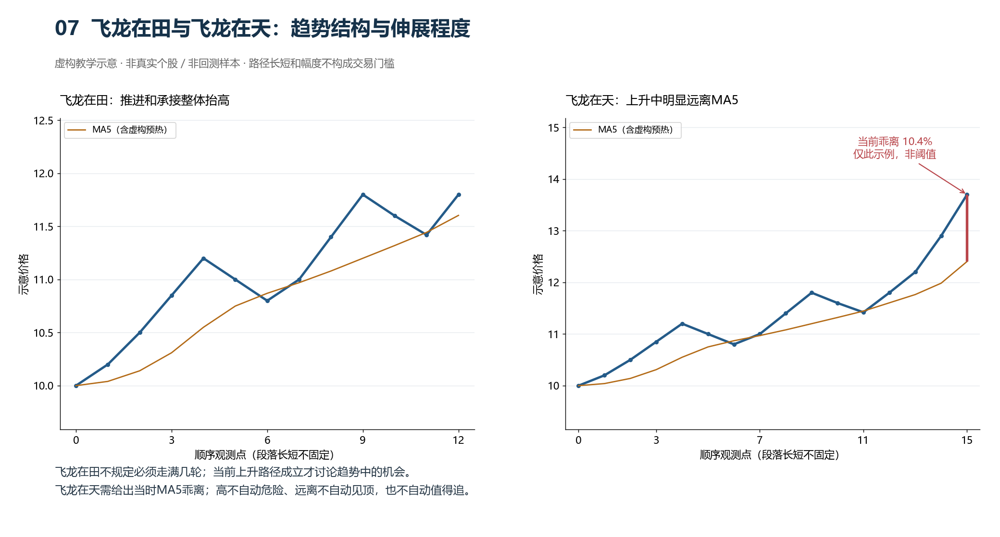

图7左侧问“推进和承接是否整体抬高”，右侧问“上升中的现价已经离MA5多远”。它们可以同时成立，不要求先结束在田才进入在天。图中的乖离是按虚构收盘序列计算的描述数值，不是策略门槛；MA5预热也用虚构历史，不对应真实股票。

**为什么关注飞龙在田。** 上升路径已经可辨认，可以研究当前推进或趋势内回踩，而不必重新等待潜龙或标准伏龙。**等待什么。** 当前回踩位置的实际响应、上推的量价和前方压力。**反证是什么。** 原局部承接已持续失守，却仍用很早以前的上涨证明当前安全。今天已有一段上涨、次日能否给利润，仍是两件事。

## 8. 飞龙在天：远离 MA5 的伸展段

### 8.1 形成过程

飞龙在天用于描述上升过程中的明显价格伸展，核心是现价相对当时MA5已经明显拉开；短期涨幅、斜率和分时扩张是补充，不能代替MA5位置核对。当前不使用未经验证的固定百分比自动命名；应写实际偏离和对应压力。

它既可能继续冲高，也可能出现冲高回落。因此飞龙在天可以是研究买点的高风险动作，也可以是观察兑现和亢龙风险的阶段。

### 8.2 真实案例只作位置与冲高风险参照

盛景微次日早盘先冲高约+4.21%，随后快速下探。已有案例记录了前高、距回探低点的距离和分时均价关系，但没有在本页独立核算当时MA5乖离，因此只作位置与冲高风险参照，不能冒称已确认的飞龙在天正例。

瑞芯微是在较弱同行截面中的个股修复案例。本页同样没有完成其当时MA5乖离核验，不能直接标成飞龙在天。它只支持继续核对个股自身路径，不能把一个案例变成“板块弱也可以无条件买”。

**为什么关注伸展。** 它提醒我们参与理由已经从回踩附近转到推进中的延续，必须重读当前位置和承接，不能继续称为低位刚启动。**等待什么。** 当时的推进、日内承接和压力关系能否支持这次研究理由。**反证是什么。** 放量而不再推进、冲高回落、局部承接破坏。图7右侧用于解释伸展本身；伸展可以延续也可以回落，不能预告明日结果。

### 8.3 飞龙在天的风险检查

- 是否已经离承接区太远；
- 前方是否存在明确旧高或涨停密集区；
- 13:30 是否低于分时均价，或冲高后重心下移；
- 上涨是否由单一股票独撑，同行是否分化；
- 量能是推进配合，还是冲高放量但价格不再推进。

## 9. 亢龙有悔：风险和结构失效，不猜最高点

### 9.1 当前含义

亢龙不是“股票已经涨到绝对顶部”的事后称号。当前只把它作为风险或结构失效观察：推进后出现失速、前高反复受压、承接低点被破坏、冲高回落与量价冲突等。

观察日只能写当时可见的风险，不能借用次日下跌证明“当时已经知道是亢龙”。如果后续重新收回并形成新的承接，原先的风险状态还要重新评估。

### 9.2 图例：表面共振仍可能失效

招商轮船的同行表现很强，但本票接近旧高，回落/推进量价和当日同刻成交额存在冲突。它说明板块强不能替代个股前高和承接判断。

朝阳科技 13:30 分时偏强，却接近历史压力，同行分化，次日先弱。它适合说明“分时强”“站均价”和“结构安全”不是同义词。

### 9.3 不能把所有下跌都叫亢龙

若股票仍在第一波后的下探，或只是一次普通惕龙回落，不能因为次日下跌就贴亢龙标签。先判断观察日是否已经出现结构破坏，再决定是“惕龙继续”“或跃失败”还是“亢龙风险”。

### 9.4 破坏之后仍可能有新一轮机会

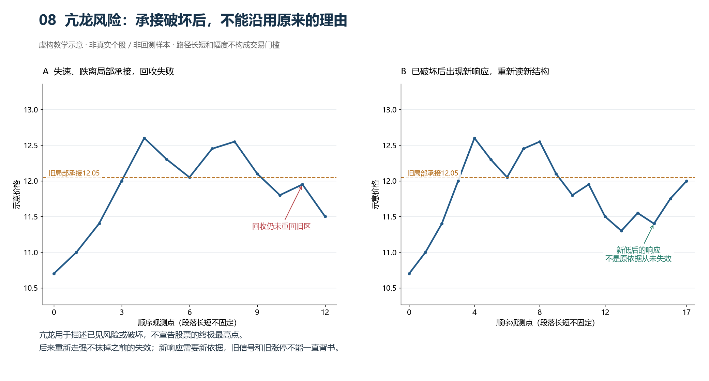

**为什么关注。** 防止继续沿用已经失效的交易理由。图8左侧跌离12.05后回收失败，是可记录的破坏；右侧之后出现新低响应，是另一个时点的新问题。不能为了后来恢复就改写“之前一直健康”。

**等待什么。** 若要重新参与，应读清新低后的响应、活动与当前承接。**反证是什么。** 反弹高点和低点继续下移、仍无法重回相关区间。招商轮船和朝阳科技的真实图展示前高与同行冲突，但没有单凭观察日证据证明终局见顶；它们不是因为次日跌了才被“确认亢龙”。

## 10. 伏龙出渊：买点动作，不是第七个生命周期阶段

### 10.1 当前动作定义

伏龙原动作与主规范一致：开盘价同时低于开盘时动态MA5和MA10，13:30观察价格同时高于当时动态MA5和MA10。可以早盘完成收回，不限定必须在13:00之后发生；开盘贴线、盘中才下穿再收回等相近动作另记差异。动态均线只使用此前N−1个已完成交易日收盘和当前价格计算。

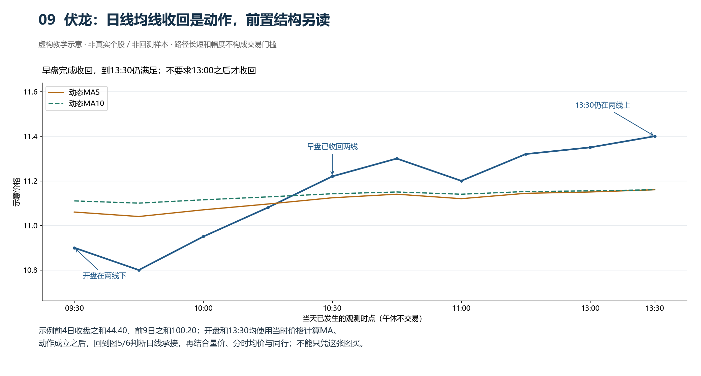

图9只证明这条虚构价格路径满足动作公式，没有画出前置生命周期，也没有分时成交额形成的均价线。因此不能凭这一张图称参与理由完整。前置结构回到图5/6核对，日线MA和分时成交均价分别判断；动作相同，所处路径可能完全不同。

这个动作只有在以下前置解释成立时才有意义：

1. 股票此前已经有第一波表现或其他可读的资金活动；
2. 当前不是仍在连续创新低的下跌段；
3. 回落、试探或趋势回踩的承接位置能够说明；
4. 前高、涨停价或压力区已经记录；
5. 13:30 前分时的真实顺序支持回收，或明确写出冲突；
6. 所属行业和同行只作为支持/冲突证据，不替代个股结构。

### 10.2 伏龙的图文读法

现有九图未全部按“伏龙”人工冻结，因此不把某一张图硬标成严格伏龙模板。可以使用以下图作为“动作依附生命周期”的参照：

它说明同一个均价回收动作，必须放在“第一波→回落→承接→再推进”的路径中解释；单独看到站上均价不能推出安全。

继峰股份当时已经离回探低点较远，属于再推进中的趋势机会。即使出现某种均线回收，也不能把它重新解释成底部起爆点。

### 10.3 伏龙失效或不宜参与的情况

- 仍处于下降趋势，只是短暂收回均线；
- 截至13:30已见反复收回又失守、价格中心未抬高；13:30以后才发生的失守只能另记，不能倒用于13:30决策；
- 低点仍在下移，旧放量或旧涨停无法提供当前承接；
- 前高太近，量价没有突破或承接；
- 行业和同行明显分化，同时本票也没有独立强的路径证据。

## 11. 行业、同行和生命周期如何联合

行业不是先于个股的硬过滤器，也不是最后补一句“板块很强”。下面是一种便于书写的检查顺序，研究时个股与同行可以往返核对：

1. 先读本票完整路径和当前生命周期；
2. 看行业指数处于上升、回落、修复还是前高压力；
3. 看同行上涨占比、站均价比例、涨停/连板数量和资金扩散；
4. 说明行业信息是支持、冲突还是缺失；
5. 回到本票，判断它是跟随、独强、滞后扩散还是板块弱势中的孤立反弹。

### 正向参照

金枫酒业、中船防务展示了个股推进与同行配合时，行业可以成为支持证据；但次日空间仍有大小差异，不能把行业共振直接等同于大肉。

### 冲突参照

瑞芯微在同行偏弱时仍给出较大机会，说明板块弱不能自动否决有独立结构的个股；招商轮船在同行强时仍失败，说明板块强不能替代本票前高和量价检查。

## 12. 给接手 AI 的逐票读盘模板

每只股票都按以下顺序写，不用分数代替解释：

1. **观察边界**：日期、13:30 参考价、数据覆盖和是否可买入。
2. **前置路径**：低点、响应、活动/放量、第一波高点、回落、试探、再推进。
3. **当前阶段**：潜龙/见龙、惕龙、或跃、飞龙在田、飞龙在天、亢龙风险，或直白描述。
4. **位置**：离回探低点、最近高点、历史前高、涨停高低价和 MA5/10/30/60 的距离。
5. **量价**：推进段、回落段、再推进段分别比较；不要求逐日递增或递减。
6. **早盘分时**：分歧释放、收回均价、重心抬高、回踩承接的实际先后；缺哪一步就写缺哪一步。
7. **行业和同行**：指数路径、同行扩散/分化、资金活动和冲突。
8. **动作参照**：伏龙、或跃、趋势回踩或涨停价回踩是否出现；说明它依附哪个生命周期。
9. **参与理由与反对证据**：为什么现在值得列候选，什么事实使它不安全。
10. **失效条件**：重新创新低、承接破坏、均价失守、前高受压、行业冲突扩大等。
11. **独立结果**：次日 09:30—11:30 的最高、最低、11:30 变化和先后顺序；不把盘中极值冒充成交利润。

## 13. 反例库：看起来符合，但当时不应直接参与

反例不是为了新增一组机械排除条件，而是训练“看到信号后还要继续读结构”。下面几例都存在上涨、放量、站均价或同行活跃中的一部分，但关键证据互相冲突。读盘时应先写事实，再决定继续观察、列候选，还是放弃这一次参与。

### 13.1 缩量回调，但价格几乎退回整段起点：天邦食品

- **表面上像机会**：前面有过一段上涨，回落量能明显收缩，13:30 也出现短暂修复。
- **可核对的冲突**：价格从2.66回到2.18，前段涨幅基本退回，13:30仅浅修复到2.28；不能仅凭缩量认定已有充分承接，也不能声称已跌破2.18。
- **当时可用写法**：深回撤后的浅修复，继续核对低点后的响应；不把缩量直接解释成健康企稳，也不因次日下跌就否认当时已有浅修复。农业综合同行很强，不能代替本票路径。

### 13.2 同行和板块都强，但本票贴近前高且量价冲突：招商轮船

- **表面上像机会**：同行上涨比例高，分时有收回过程，板块内部看起来存在共识。
- **真正的问题**：13:30 已接近 22.90 旧高，离回落低点较远；回落/推进量没有收缩，同刻成交额却偏弱，说明继续向上的证据不完整。
- **当时正确写法**：飞龙在田后段、前高压力下的再试探，列为观察或降低优先级，不能因为同行强就直接推荐。

### 13.3 分时强、站上均价，但旧高太近：朝阳科技

- **表面上像机会**：早盘五分钟收价在均价上方，个股当日走势看起来比多数同行强。
- **真正的问题**：价格已经贴近历史压力位 26.44，同行站均价比例低；分时强只说明当时买卖力量偏强，不等于压力已经消失。
- **当时可用写法**：再推进接近历史压力，保留同行与压力冲突；不能把“站均价”单独当作伏龙或安全信号，也不新增“必须突破所有前高”的门槛。

### 13.4 早盘先给冲高，再快速破坏承接：盛景微

- **表面上像机会**：已经从 42.50 回升到 52.52，次日早盘最初出现约 4.21% 的冲高空间。
- **真正的问题**：13:30 价格贴近 52.74 旧高且低于当日均价，同行站均价比例很低；冲高后价格中心快速下移。
- **当时可用写法**：离回探低点较远、接近旧高且低于分时均价；MA5乖离尚未核验，不强标飞龙在天。次日机会和风险另记，不能只留最高冲高，也不能写成完全没有机会。

### 13.5 仍在连续破低，只是短暂收回短均线：严格伏龙的反例

伏龙动作本身也可能出现在错误位置：开盘低于 MA5/MA10，午前重新收回两条均线，但前置低点仍按 11.00→10.80→10.60 下移，13:30 的收回没有改变下降路径。

- **表面上像机会**：信号条件成立，且同行可能同步上涨。
- **真正的问题**：最新低点仍在下移，均价回收没有形成新的承接；这是下降中的短暂反弹，不是回落后的再推进。
- **当时正确写法**：动作记为“伏龙样动作”，生命周期记为“惕龙未完成/或跃失败后修复待确认”，继续观察而不直接参与。

### 13.6 反例的共同检查顺序

1. 先问低点之后是否真的停止下移，而不是只看当前价格离大底多远。
2. 再看前高、涨停锚点或密集成交区是否就在眼前。
3. 把推进段、回落段和当前同刻量额分开比较，不用“放量/缩量”四个字替代过程。
4. 复核分时是一次站上均价，还是分歧释放、收回、重心抬高和回踩承接连续发生。
5. 将行业指数和同行扩散与个股互相核对；必要时回头重读本票，不规定必须最后才看板块。

这些反例用于减少误选，不构成“前高近就一定不买”“同行弱就一定不买”等硬门槛。只有在更大样本中重复出现、并完成同口径回测后，才考虑把某种事实写入候选排序。

## 14. 低点确认：事后低点不等于当时可确认低点

“低点”是最容易被事后走势污染的判断。图表走完以后，我们可以看见某一天就是阶段最低点；但在观察日当时，只能根据已经出现的价格响应判断它是否值得继续跟踪。

### 14.1 三种写法要分开

1. **候选低点**：某日出现低点，后面暂时没有马上破低，但还没有足够响应。只能写“记录低点”，不能写“已经企稳”。
2. **响应确认**：低点之后出现推进、收回或连续承接，并且后续回探没有立即破坏低点。此时可以把它纳入“第一波之后的观察路径”。
3. **结构失效**：低点再次被有效跌破，或每次反弹高点和低点都继续下移。原低点不能继续作为当前承接锚点，需要重新观察。

### 14.2 正反对照

金枫酒业曾回到前段低位附近，但后面重新出现推进和整理。读盘时，真正有用的事实不是“它回到了低点”，而是“回到低点后有没有新的价格响应”。

天邦食品同样出现缩量回落，但价格几乎退回前段起点，观察日只出现浅修复。它不能因为缩量或同行变强就被写成“健康企稳”。

### 14.3 当时不能偷看未来

读盘记录应明确写出：

- 观察日以前已经知道的低点和高点；
- 观察日当时是否已经出现价格响应；
- 哪个事实仍待下一根或下一段走势确认；
- 如果随后破低，原判断应如何改写。

“后来成为最低点”只能用于复盘解释，不能反过来证明当时已经知道它是最低点。这是避免未来函数和事后贴标签的基本边界。

## 15. 相似形态为什么会得到不同结果

不能只用“有回调”“有放量”“回到了前低”给股票归类。至少要把以下差异写出来：

|比较项|可能看起来相同|真正需要区分的事实|
|---|---|---|
|回调|都从一段上涨后回落|回调是否退回整段起点，是否跌破最近有效承接|
|量能|都出现缩量|缩量期间价格是否稳定，还是缩量下跌却持续失守|
|低点|都接近旧低点|旧低点后有没有重新推进，还是只出现短暂反弹|
|均价|都曾站上分时均价|是一次收回，还是分歧释放、重心抬高、回踩后继续站稳|
|板块|同行都在上涨或都很弱|本票是跟随、独强、滞后扩散，还是孤立反弹|

因此，金枫酒业与天邦食品不能归为同一类；招商轮船与瑞芯微也不能仅凭同行强弱归为同一类。前者的关键差别在个股是否重新推进，后者的关键差别在个股自身是否有独立路径和可用空间。

## 16. “有冲高”不等于“买得到、卖得出”

隔日套利必须把买入日与卖出日分开。先核对观察日13:30能否买入，再研究下一交易日09:30—11:30持有者的卖出机会；次日最高价不等于实际成交利润。次日一字涨停难以新买，不等于前日已买入者必然卖不出，具体数量的成交能力仍需相应证据。

### 16.1 至少记录四个结果

1. **交易可执行性**：买入日13:30的可买入记录，与次日上午的卖出成交证据分别记录，不把次日新买入难度当成本策略收益过滤项。
2. **首次冲高**：09:30 后第一次明显上冲的时间和幅度，不能只看全天最高点。
3. **回落风险**：冲高后是否跌破分时均价、重心是否下移、最低点何时出现。
4. **可兑现窗口**：09:30—11:30 内是否出现足够的冲高和可执行的卖出机会；最高空间与11:30价格必须分开。

盛景微就是典型边界：次日早盘先有约 +4.21% 的冲高，随后快速下探。它既不能被写成“完全没有机会”，也不能把 +4.21% 当成必然可成交利润。成功、失败和先冲后跌必须分开统计。

### 16.2 买不进去的样本怎么处理

观察日13:30买不进去的股票仍可作为市场行为样本，但不能与当时有可交易价格的样本混算机会。记录可买入性：有交易价格、停牌或无成交、封板不可买、数据不足；分钟数据不自动证明任何数量都可成交。次日卖出困难、卖出价格和费用另外记录。

## 17. 涨停价锚点：四种状态不能混为一谈

### 17.1 为什么涨停值得记住，却不能一直给当前走势背书

涨停事件让我们知道价格曾被推动到当日上限，也留下低价、高价、封板价和后续平台等参照。我们关注它，不是因为“涨停过就一定再涨”，而是可以沿同一个事件追问：推动之后，价格是留在新区域、回到原点、刺破又收回，还是继续跌离？这为观察后续承接提供了可核对的起点。

放量涨停与低量一字板要分别描述。前者说明发生了较多换手并触及上限；后者的已成交量可能较少、可成交卖盘有限，不能仅凭量小否认价格推动，也不能据此断言具体主力持仓。只触板又打开和最终封住也不同。当天封板买不进时只留观察，之后有可解释的整理或回踩再评价。

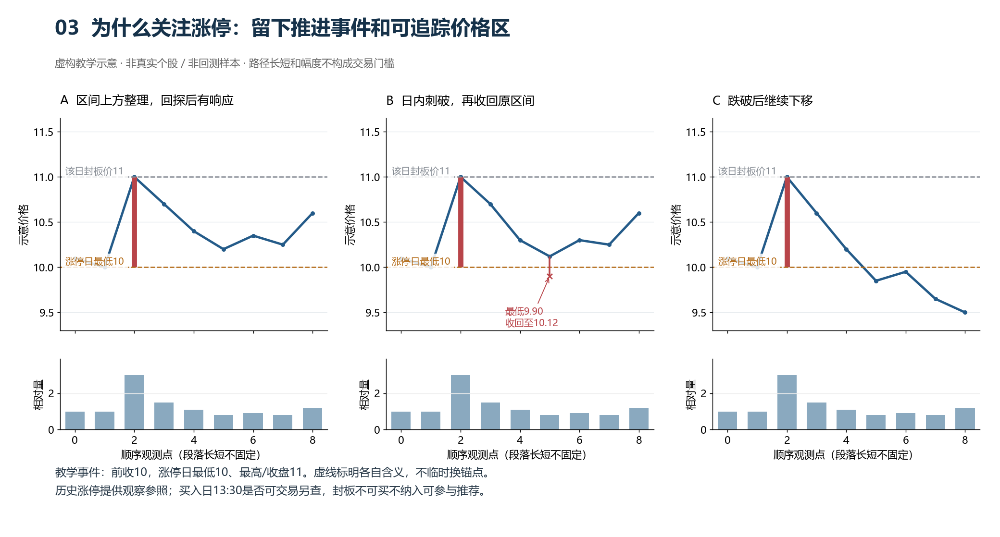

图3的教学涨停日最低10、封板价11。A后来在10上方回探并响应；B盘中到9.90、收回10.12，事实是“破过后收回”，不是始终未破；C跌离之后继续下移，不能只因曾涨停就称洗盘。最高/最低、封板价与平台边界各自记录；不能上一个锚点失效后偷偷换线。

**为什么等待整理。** 整理和回踩提供观察此前推动是否仍被接受的过程，而不是凭第一次涨停预测第二天。**什么时候值得重新评价。** 当前相关区间有实际响应，位置、分段量价、截至13:30的分时及同行能共同解释这次参与。**什么时候继续等。** 仍下移、反复收回失败、或当前处于哪个区间都说不清。这里未规定必须等几天、一定守哪一根线，也没有证明此路线比其他路线胜率更高。

### 17.2 后续四种状态分别记录

涨停或大阳线的最高价、最低价可以作为观察锚点，但锚点不是自动支撑位。复盘时按后续价格行为分四类记录：

1. **低点上方承接**：回踩没有有效跌破涨停最低价，随后重新推进。说明该价格区间暂时仍有承接，但还要看当前是否离前高过近。
2. **盘中刺破后收回**：盘中短暂跌破后快速收回，且后续低点不再下移。需要记录刺破幅度、成交变化和收回后的重心，不能只写“没有跌破”。
3. **跌离后回收失败**：截至可见时点价格持续位于原锚点下，回收仍失败，原区间不能继续被描述为一直有效的承接。已完成历史日可看其收盘，当日13:30不能提前用收盘确认。
4. **反复试探但没有推进**：多次到同一区间但尚未重新推进，继续辨别是承接整理还是走弱。未创新高本身既不能证明失败，也不能证明强势；要看低点、收回和量价。

当前案例资料对上述四类的完整同口径样本还不够，因此本节是统一记录方法，不是已经验证的过滤条件。今后新增涨停样本时，必须同时保存涨停日、后续最低点、是否收回、成交变化和次日可执行窗口。

### 17.3 从活动线索到每日持续观察

|时点|沿着同一股票记录什么|何时更新判断|
|---|---|---|
|发现活动|活动日/段、量额基准、价格位移、涨停高低价（如有）|记录线索，不直接推荐|
|第一波显现|低点响应、已见推进、前方压力；高点是否仍更新|具备路径后纳入持续观察|
|回落或整理|沿当前相关区间看量价、试探和失守，不机械等天数|未见响应继续等；破低则重读|
|当日13:30|最新生命周期、价格位置、早盘过程、同行及冲突|依据完整才作当日候选；是否伏龙另记|
|下一次更新|原判断与独立次日结果、当前结构的新变化|次日没表现不永久删除；新的机会要有新的当日依据|

已有上升结构的股票可以从当前回踩开始复核，不必倒回去找一个新潜龙。历史活动是持续观察的背景，最新价格路径才决定现在在观察什么。

## 18. 反例读盘的完整顺序

面对一个看似符合的股票，按以下顺序写事实：

1. 先确认低点是否只是候选，还是已经出现响应；
2. 再确认第一波、回落和当前再推进是否真实存在；
3. 检查前高、涨停锚点和密集成交区是否近在眼前；
4. 分开比较推进段、回落段、当前同刻量额，不用“放量/缩量”代替过程；
5. 复核早盘分时的完整顺序，而不是只看是否站上均价；
6. 判断行业指数和同行是支持、冲突还是缺失；
7. 最后记录可买入性、首次冲高、回落和可兑现窗口；
8. 明确反对证据和失效条件，再决定参与、观察或放弃。

这个顺序的目的是让事实、解释、反证和交易结果分别可检查。可能出现逻辑完整而次日失败、或者结果暂时无法解释的记录；不要求给每一次涨跌编出确定原因，也不根据结果倒改生命周期。

## 19. 当前研究阶段与下一步

当前仍是 **V3.2-D009 生命周期优先读盘验证阶段**。本指南保留D008的低点确认、结果可执行性、涨停锚点和相似形态对照说明；D009新增两张虚构教学图，补充活动线索到候选的流程以及板块/同行互证。没有新增筛选门槛、没有重写收益统计，也没有证明80%胜率或稳定大利润。

下一步仍按三组复核推进：

- 入选后冲高空间大的案例；
- 入选后大跌或先冲后跌的案例；
- 观察池中漏掉、但次日冲高空间大的案例。

每组都要按同一模板复核生命周期、位置、量价、分时、行业和同行。先找能够稳定解释风险的事实，再决定是否需要调整候选排序；不能因为一个成功或失败案例就新增硬门槛。

